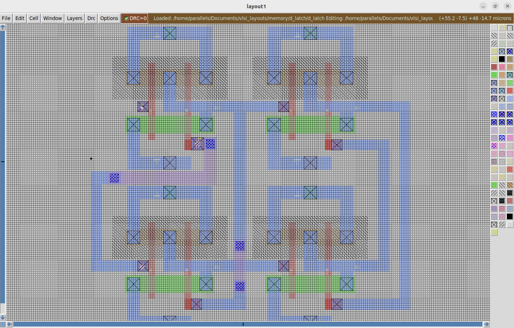
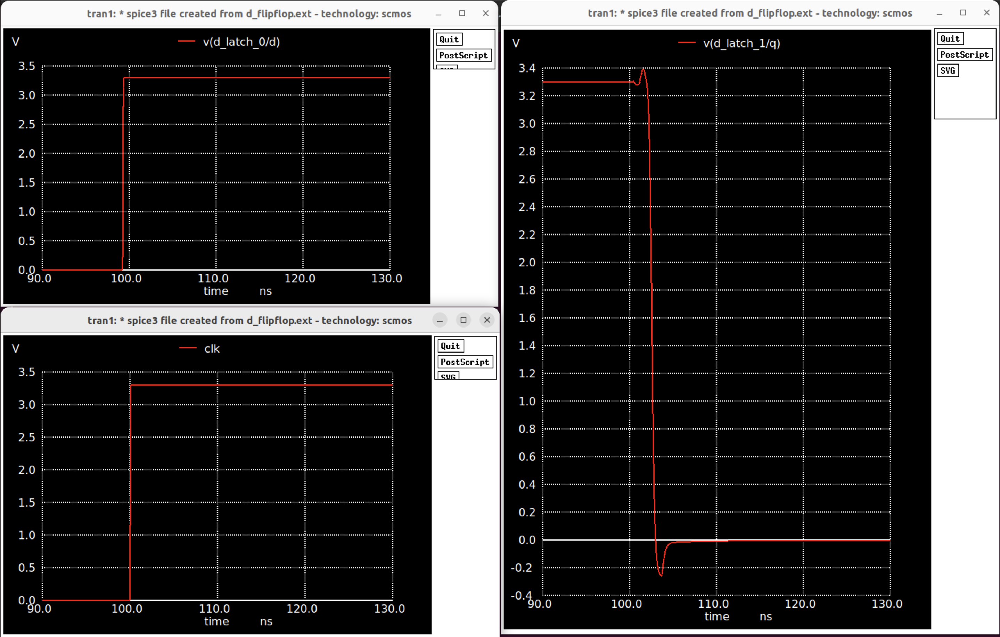

# The Fundamental Basics

## What is Metastability?
Metastability is a physical phenomenon that happens in digital systems when signals rest in an undefined intermediary state 
instead of 1's and 0's. Such signals can resolve unpredictably and cause unwanted oscillations and data corruption. This state
is often observed in memory circuits, where setup/hold time violations cause an output signal to go metastable, as the feedback loop
in such circuits don't have enough time to stabilize to the new input, leading to the output being driven by multiple signals with 
different voltages. 

## Analog Simulation with Parasitics

### Magic VLSI Physical Layout
Here we first implement the D-latch in Magic in order to create our two flip-flops. Since we are using a positively edge triggered flip flop the master D flip-flop should be transparent when clock is low and we want the slave D flip-flop to be opaque when clock is high (reversing these two gets a negatively edge triggered flip flop. For those who don't know why, drawing the waveforms from the two D-latches is a simple but intuitive exercise). 
<p align="center">
    
    <br>
    <em>Figure 1: Layout of a D latch with NAND gates.</em>
</p>

### SPICE Directive/Simulations (ngspice)
First we will create the SPICE directive of the D-latch and verify that it works. Quick note: the specific CMOS technology I'm using in Magic is the AMI 0.5µm CMOS node.
```SPICE
Vin_d d 0 PULSE(0 3.3 1n 0.1n 0.1n 10n 20n)
Vin_en en 0 PULSE(0 3.3 0n 0.1n 0.1n 40n 80n)

.tran 0.1n 200n
.control
run
plot d
plot en
plot Q
plot Q_not
.endc

.end
```
Let's now look at the waveform and verify that it indeed works as a D-latch before we make our D flip-flop. 

<p align="center">
    
    <br>
    <em>This looks correct!</em>
</p>

By extension we can now create a positive edge-triggered D flip-flop using two of those latches that we just made and two inverters (technically you can get away with using just one inverter for the master D-latch):
<p align="center">
    
    <br>
    <em>Figure 2: D Flip-Flop Layout.</em>
</p>

Here's the SPICE level simulation of that layout using this SPICE directive:
```SPICE
* clock: 3 pulses, 150ns period, 60ns high / 90ns low
Vin_clk clk 0 PULSE(0 3.3 0n 0.1n 0.1n 60n 150n)

* d starts HIGH, then goes LOW at 30ns (while clock is HIGH!)
Vin_d d_latch_0/d 0 PULSE(3.3 0 30n 0.1n 0.1n 400n 1000n)

* transient simulation
.tran 0.1n 400n

.control
run
plot clk
plot v(d_latch_0/d) 
plot v(d_latch_1/q) 
plot v(d_latch_1/q_not) 
.endc

.end
```
Here's the waveform to see the flip flop output being driven by the edge of the clock, not the logic level. Notice that D
changes while the clock is high but Q does not change as it only samples during the rising edge.
<p align="center">
    
    <br>
    <em>These waveforms are beautiful. 😍</em>
</p>

### Setup and Hold Times of D flip-flop

Doing some playing around for the setup time, I was able to identify `0.78ns` as the bare minimum setup time needed
between the D input toggling and the clock transitionining in order for the flip flop to sample correctly. Note that setup
time is the time that D must be stable before the rising clock edge. Here's the spice directive:

```SPICE
* visual setup time test
.param tsetup=0.77n

Vin_clk clk 0 PULSE(0 3.3 100n 0.1n 0.1n 50n 500n)
Vin_d d_latch_0/d 0 PULSE(0 3.3 {100n-tsetup} 0.1n 0.1n 200n 500n)

.tran 0.01n 150n

.control
run
plot clk xlimit 90n 130n
plot v(d_latch_0/d) xlimit 90n 130n
plot v(d_latch_1/q) xlimit 90n 130n
.endc
```

Here's the waveform when setup time is not violated (>= 0.78ns):
<p align="center">
    
    <em>
        Q is sampled correctly with the input D as D changes before the rising edge of the clock.
        Admittedly it is a bit sharp of a curve but the output stays above 3V.
    </em>
</p>

Here's the waveform when setup time **is** violated (< 0.78ns):
<p align="center">
    
    <em>Q is completely wrong here and stays low when it should be high. 😱 </em>
</p>

Here Q does not sample properly because D changes `0.77ns` before the clock edge is set to transition. In an ideal
flip flop, Q should've been driven high but instead it's driven low because of this setup time violation.

Finding the minimum hold time works in the opposite direction, just how long does D have to be stable after the clock has transitioned.
Using this SPICE directive:
```SPICE
* visual hold time test
.param thold=0.77n

Vin_clk clk 0 PULSE(0 3.3 100n 0.1n 0.1n 50n 500n)
Vin_d d_latch_0/d 0 PULSE(0 3.3 {100n+thold} 0.1n 0.1n 200n 500n)

.tran 0.01n 150n

.control
run
plot clk xlimit 90n 130n
plot v(d_latch_0/d) xlimit 90n 130n
plot v(d_latch_1/q) xlimit 90n 130n
.endc
```

It's not easy to show metastability in SPICE simulations, but you can see that time violations can lead to just wrong
information. At the best case you have metastability issues that can't reliably resolve to the intended bit, and at the
worst case (as you can see in the diagram), you get wrong data that can cause systems to shut down. 

## MBTF Calculations

## Timing Theory
