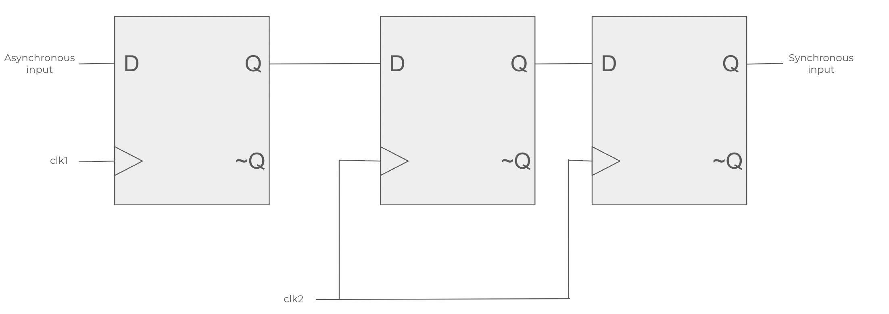

# Multi-Flop Synchronizers

## Preface
Multi-flop synchronizers are the most common approach to addressing metastability in clock domain crossings. The premise is to use
two (sometimes more) D flip-flops to chain the asynchronous input and synchronize it to the new clock domain. The inherent issue 
with asynchronous inputs is that it could come at any time; this is fundamentally problematic if a change in the asynchronous input
happens within the setup or hold time of a D flip-flop. When this happens, the output of the D flip-flop can be unpredictable, leading
to failure in larger integrated systems. We cannot prevent an asynchronous input from being sampled within the setup/hold time, but we 
can reduce the effect of them by allowing the metastable signal to resolve itself before we sample and use it.

## Circuit Schematic
<p align="center">
    
</p>

The first flip flop is run on some source clock, whereas the last two flip flops are clocked using the destination clock. Output Q from
the first flip flop is sampled onto the first flop, where it could run the risk of metastability. It takes at least two clock cycles for the
metastable signal to propagate to the second flop, which should be resolved by then.

## Verilog Implementation (Behavioral)

Here's the HDL implementation of a double flop synchronizer using Verilog:

```Verilog
`timescale 1ns / 1ps

// creating a simple two flop synchronizer

module multi_flop (
    input  wire async_data,    // asynchronous input
    input  wire dst_clk,       // destination clock domain
    input  wire rst_n,         // active low rst     
    output wire sync_data      
);

    // two flip-flops for synchronization
    reg sync_ff1;
    reg sync_ff2;
    
    // flops clocked by destination domain clock
  always @(posedge dst_clk or negedge rst_n) begin
    if (!rst_n) begin
            sync_ff1 <= 1'b0;
            sync_ff2 <= 1'b0;
        end else begin
            sync_ff1 <= async_data;  // first flip flop can go metastable here
            sync_ff2 <= sync_ff1;    // takes an additional clock cycle to propagate
        end
    end
    
    assign sync_data = sync_ff2;

endmodule
```
## Testbench 
We're using a testbench with random signals to verify for correctness and see if the pulse is synchronized to the new clock domain:
```Verilog
`timescale 1ns/1ps

module tb_multi_flop();
    reg async_data;
    reg dst_clk;
    reg rst_n;
    wire sync_data;

    // instantiate the unit under test
    multi_flop uut (
        .async_data(async_data),
        .dst_clk(dst_clk),
        .rst_n(rst_n),
        .sync_data(sync_data)
    );

    // destination clock (period = 10ns)
    initial dst_clk = 0;
    always #5 dst_clk = ~dst_clk;

    initial begin
        async_data = 0;
        rst_n = 0;
        #20;              // hold reset low first
        rst_n = 1;

        // toggle async_data at irregular times
        #7  async_data = 1;
        #13 async_data = 0;
        #11 async_data = 1;
        #19 async_data = 0;
        #4  async_data = 1;
        #30 async_data = 0;

        // random-ish toggles
        repeat (10) begin
            #($urandom_range(3,15)) async_data = ~async_data;
        end

        #100 $finish;
    end
endmodule
```

Unfortunately, metastability will not be visible under a simulator and we will need to resort to either physical or analog simulations
to visually see the metastability phenomenon happen in the synchronizer (particularly the waveform output of the first flip flop in the
synchronizer).

## Analog Simulation with Parasitics

### Magic VLSI Physical Layout
Here we first implement the D-latch in Magic in order to create our two flip-flops. Since we are using a positively edge triggered flip flop the master D flip-flop should be transparent when clock is low and we want the slave D flip-flop to be opaque when clock is high (reversing these two gets a negatively edge triggered flip flop. For those who don't know why, drawing the waveforms from the two D-latches is a simple but intuitive exercise). 
<p align="center">
    
    <br>
    <em>Figure 1: Layout of a D latch with NAND gates.</em>
</p>

### SPICE Directive

### SPICE Simulation (ngspice)

## Advantages/Disadvantages
A multi-flop synchronizer sounds like an easy solution to solving metastability issues; adding an additional flop to the end of the first flop statistically allows for enough time for the metastable signal to settle before being sampled again by the second flip flop, only requiring an additional clock cycle. It's very simple to implement, very inexpensive in FPGA fabric (due to only using 2 flip flops), and has predictable latency. However, there are drawbacks as well:
- Only works for single bits; in multi-bit buses different bits may resolve at different times, which could lead to race conditions. Usually a different technique like handshaking is used instead.
- Metastability isn't fully resolved; while the chance of the second flip flop is exponentially lower than the first flip flop, it is still theoretically possible. With this said, it is extremely cheap and reliable enough for most applications.
- Short pulses or back-to-back transitions can be lost since flop synchronizers only guarantee safe transfer of signal levels, not event pulses.
- Additional latency: in critical ultra-low latency applications those additional two clock cycles that it takes for the signal to propagate can be detrimental.
