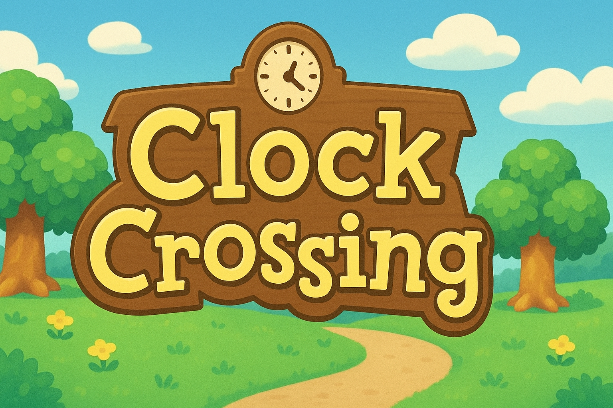

# 🎮 Clock Crossing

  

Welcome to my GitHub repository Clock Crossing! This is a place where multiple clocks live in harmony (mostly), and signals learn to cross domain boundaries without causing metastability chaos. Whether you're a visiting engineer or a longtime resident of asynchronous design, this guide will help you navigate the crazy world of clock domain crossings.

---

## 🌊 Why Clock Crossing Matters

Modern digital systems are like bustling cities with different time zones. Your processor runs at 3GHz, your memory at 800MHz, your USB controller at 480MHz—all living together on the same chip. When signals travel between these "time zones," **bad things can happen**. In real life, unchecked errors in large semiconductor companies can suck up millions of dollars on chips that don't work.

### ⚠️ The Metastability Problem

When a signal crosses between clock domains at *just* the wrong moment, a flip-flop can enter a **metastable state**—an undefined limbo between 0 and 1. This causes:

- ❌ **Data corruption** - Wrong values propagate through your system
- ❌ **System crashes** - Control signals fail unpredictably  
- ❌ **Timing violations** - Downstream logic gets garbage
- ❌ **Silicon respins** - Millions of dollars and months of delay

**The scary part?** CDC bugs are:
- 🎲 Non-deterministic (happen randomly based on timing)
- 🔍 Nearly impossible to catch in simulation
- 💰 Catastrophic in production silicon
- ✅ **Completely preventable** with proper synchronizers

---

## 🏘️ Current Residents (Synchronizer Types)

Each synchronizer is a different "neighbor" in Clock Crossing, with its own personality and use case:

### 🤝 [Handshake Synchronizer](./handshake/) 
*The friendly neighbor who always confirms receipt*

  

- **Best for:** Single-bit control signals, no data loss allowed
- **Personality:** Reliable but chatty (takes time to acknowledge)
- **Use case:** Starting/stopping modules, sending commands

### 🔄 [Toggle Synchronizer](./toggle/)
*Always flipping out (literally)*

  

- **Best for:** Pulses that need to cross domains
- **Personality:** Energetic, never misses a beat
- **Use case:** Interrupt signals, event notifications

### 📬 [FIFO Synchronizer](./async-fifo/)
*The reliable mailbox*

  

- **Best for:** Multi-bit data, burst transfers
- **Personality:** Organized, handles lots of traffic
- **Use case:** Streaming data between clock domains

### 🔀 [MUX Synchronizer](./mux-recirc/)
*The quick decision maker*

  

- **Best for:** Fast single-bit control signals
- **Personality:** Efficient, makes quick choices
- **Use case:** Select signals, enables

### 🌊 [Pulse Synchronizer](./pulse/)
*The town crier*

  

- **Best for:** Short pulses that need to propagate
- **Personality:** Loud and clear, one message at a time
- **Use case:** Triggering events, one-shot signals

### 👥 [Multi-Flop Synchronizer](./multi-flop/)
*The simplest neighbor on the block*

  

- **Best for:** Single-bit quasi-static signals
- **Personality:** Simple, reliable, everyone's first friend
- **Use case:** Status flags, mode settings, anything that changes slowly

**Fun fact:** This is the synchronizer you'll use 80% of the time!

### 🎨 [Gray Code Counters](./gray-code/)
*The mathematician*

  

- **Best for:** Counter values crossing domains
- **Personality:** Precise, changes one bit at a time
- **Use case:** FIFO pointers, address synchronization

---

## 📚 What is Provided in Each Exhibit?

Every synchronizer directory includes a:

- 📐 **Schematic** - Clear block diagrams of the digital gates 
- 💻 **Verilog Code** - Synthesizable RTL code written in Verilog
- ⚡ **SPICE Simulation** - Transistor-level validation with parasitics
- 📊 **Waveforms** - Simulation results showing correct operation
- 📝 **Documentation** - When to use it, how it works, common pitfalls

---

## 🚀 Getting Started

**New to CDC?** Start here:
1. [Multi-Flop Synchronizer](./multi-flop/) - Learn the basics
2. [Handshake Synchronizer](./handshake/) - Understand bidirectional communication
3. [Async FIFO](./async-fifo/) - See how to move data safely

**Already know CDC?** Jump to:
- [Gray Code Counters](./gray-code/) - Advanced pointer synchronization
- [MUX Synchronizer](./mux-recirc/) - High-performance alternatives

---

## 🔗 Related Projects

- **[Cell Museum](https://github.com/AxC1271/CellMuseum)** - The transistor-level building blocks used in these synchronizers
- **[RISC-V Processor](https://github.com/AxC1271/RISC-VProcessor)** - My processor design that motivated learning CDC

---

## 🏪 Museum Hours

**Open 24/7** - All clock domains welcome!

Whether you're in the fast-lane GHz club or the slow-and-steady KHz crowd, there's a synchronizer here for you.

---

**Built with careful timing analysis ⏰ at Case Western Reserve University**

*P.S. - No flip-flops were harmed in the making of this repository (though a few entered metastable states temporarily).*
